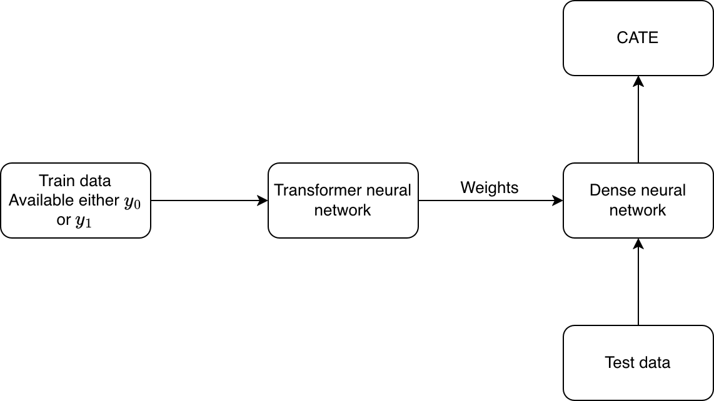
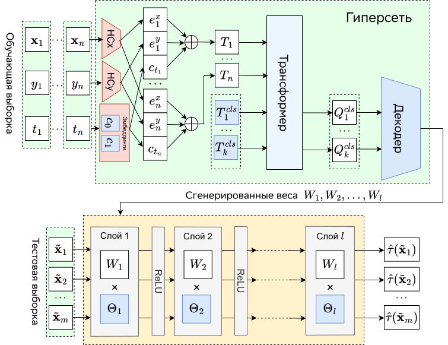

# FoCAT: Foundation Causal Adaptive Transformer

**FoCAT** (Foundation Causal Adaptive Transformer) is a transformer-based hypernetwork for estimating Conditional Average Treatment Effects (CATE). Unlike conventional models that require training and hyperparameter tuning, FoCAT takes a training dataset as input and instantly generates the weights of a fully connected neural network for inference. This architecture eliminates the need for iterative optimization at test time and enables extremely fast inference. The model is trained on a wide variety of synthetically generated tasks, allowing it to generalize across diverse data distributions without explicit regularization.

## How does it work

FoCAT consists of two parts: transformer neural network and a dense neural network. The main data processing pipeline can be described by the following diagram:



A more detailed view is provided in the following diagram:



The main advantage of this architecture is that we can perform training on the huge amount of a syntetic datasets with the simulated conditional average treatment effect. After training, FoCAT further doesn't need to perform fine-tuning on the test data or a search for optimal hyperparameters (it is actually impossible to do in the context of treatment effect estimation). The data generation process is illustrated in the following diagram:

.drawio.svg)

## Environment Setup

To set up the environment using `conda`, run the following commands:

```bash
conda env create -f environment.yml
conda activate ticl
```

Make sure you have [Anaconda](https://www.anaconda.com/) or [Miniconda](https://docs.conda.io/en/latest/miniconda.html) installed.

## Codebase Acknowledgment

This codebase builds upon the architecture and implementation of **Mothernet**, developed by Noah Hollmann, Samuel Müller, Katharina Eggensperger, and Frank Hutter at the University of Freiburg. We gratefully acknowledge their work, which served as a foundation for the development of FoCAT.

